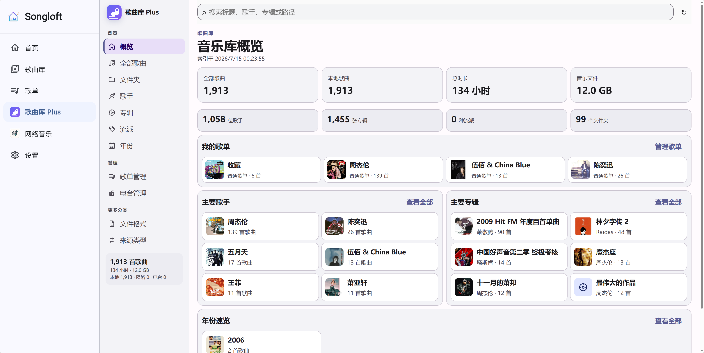
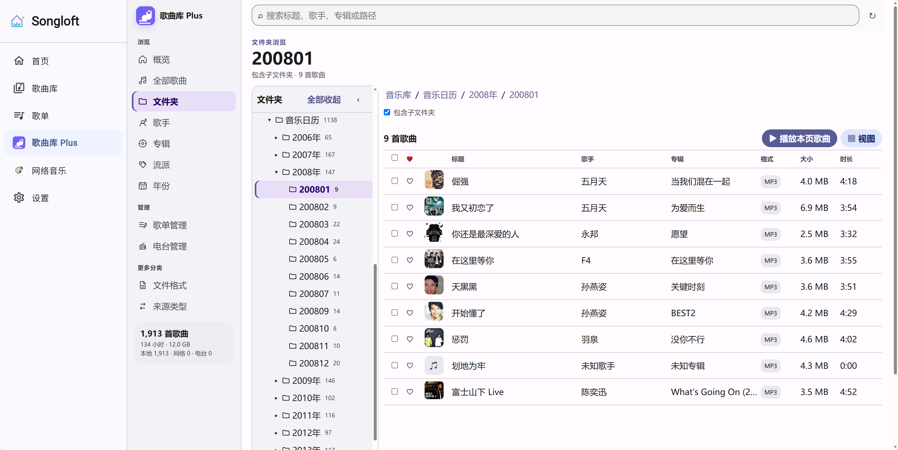
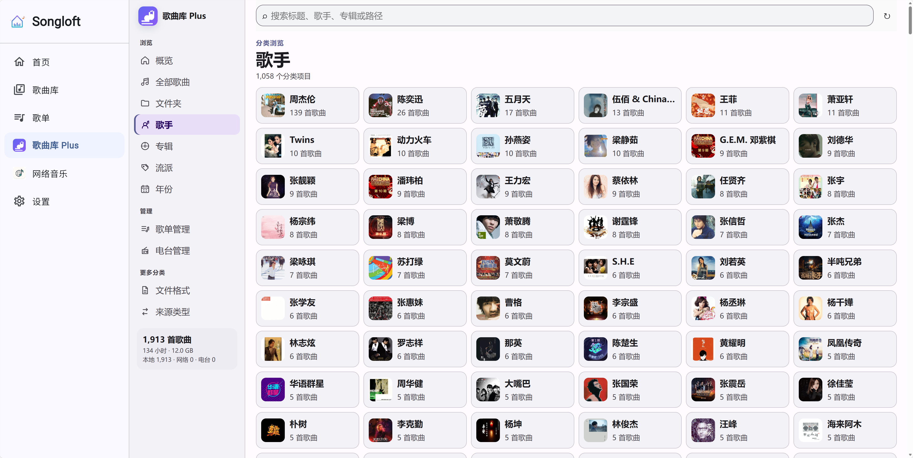
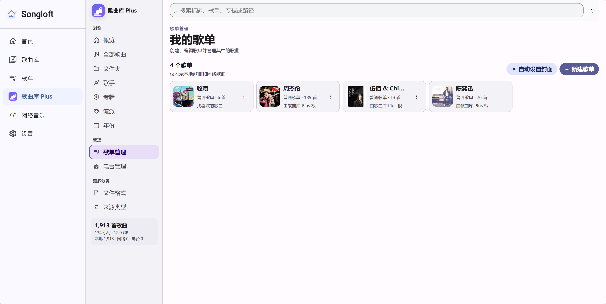

# 🎵 Songloft 歌曲库 Plus

Songloft 歌曲库 Plus 是一款面向 [Songloft](https://github.com/songloft-org/songloft) 的歌曲库增强插件。它在原有歌曲库基础上扩展了多维浏览、批量管理、收藏、歌单、电台和标签编辑能力，让较大规模的音乐库更容易查找、整理与播放。

> 🤖 本插件由 AI 生成。欢迎通过 GitHub Issues 反馈使用中遇到的问题与改进建议。

## 🔗 关于 Songloft

[Songloft](https://github.com/songloft-org/songloft) 是本插件所依赖的音乐服务项目。本插件基于 Songloft 提供的插件能力开发，是独立维护的扩展项目，并非 Songloft 主程序的内置组件。

- 上游项目：[songloft-org/songloft](https://github.com/songloft-org/songloft)
- 最低兼容版本：Songloft v2.11.0
- 语种、风格等能力会根据当前 Songloft 版本自动检测

## ✨ 功能亮点

### 多维浏览

- 按文件夹、歌手、专辑、流派、年份、语种、风格、来源和文件格式浏览音乐
- 音乐库概览集中展示曲库统计、歌单、主要歌手、主要专辑与年份信息
- 文件夹树与歌曲列表采用左右布局，支持层级展开、整体折叠和深层目录浏览
- 支持全局搜索、表头排序、数字分页和页码快速定位

### 高效管理

- 支持单选、连续选择、鼠标拖选、移动端长按拖选、全选、反选和取消选择
- 批量操作支持播放、收藏、加入歌单、编辑标签和删除曲库记录
- 智能识别多首歌曲标签的共同值，只提交实际修改的字段
- 可设置每页显示数量、歌曲列表视图和可见列，并自动记忆常用设置

### 收藏、歌单与电台

- 歌曲列表直接显示收藏状态，可一键收藏、取消收藏或按收藏状态排序
- 支持普通歌单与电台歌单的创建、编辑、删除和内容管理
- 可根据歌手、专辑、流派或年份自动创建同名歌单，并自动跳过重复歌曲
- 自动从歌单内带封面的歌曲中随机选择并设置歌单封面

### 播放体验

- 点击歌曲封面开始播放，避免浏览或选择歌曲时误触播放
- 支持播放本页歌曲、播放选中歌曲以及查看当前播放队列
- 提供紧凑的响应式界面，兼顾桌面端和移动端使用


## 🖼️ 界面预览

<table>
  <tr>
    <td align="center"><strong>001</strong></td>
    <td align="center"><strong>002</strong></td>
    <td align="center"><strong>003</strong></td>
    <td align="center"><strong>004</strong></td>
  </tr>
  <tr>
    <td><a href="https://raw.githubusercontent.com/charce526/songloft-library-plus/main/screenshots/001.png" target="_blank"></a></td>
    <td><a href="https://raw.githubusercontent.com/charce526/songloft-library-plus/main/screenshots/002.png" target="_blank"></a></td>
    <td><a href="https://raw.githubusercontent.com/charce526/songloft-library-plus/main/screenshots/003.png" target="_blank"></a></td>
    <td><a href="https://raw.githubusercontent.com/charce526/songloft-library-plus/main/screenshots/004.png" target="_blank"></a></td>
  </tr>
</table>

## 📦 安装

1. 下载 [library-plus.jsplugin.zip](https://github.com/charce526/songloft-library-plus/releases)。
2. 打开 Songloft 插件管理页面。
3. 上传安装包并启用“歌曲库 Plus”。

## 🛠️ 本地构建

```bash
npm install
npm test
npm run build
```

构建后的版本化插件安装包位于 `dist/` 目录。

开发模式：

```bash
npm run dev
```

## 📄 许可证

本项目采用 [Apache License 2.0](./LICENSE) 开源许可证。Songloft 本身的授权与使用条款请以上游项目为准。
